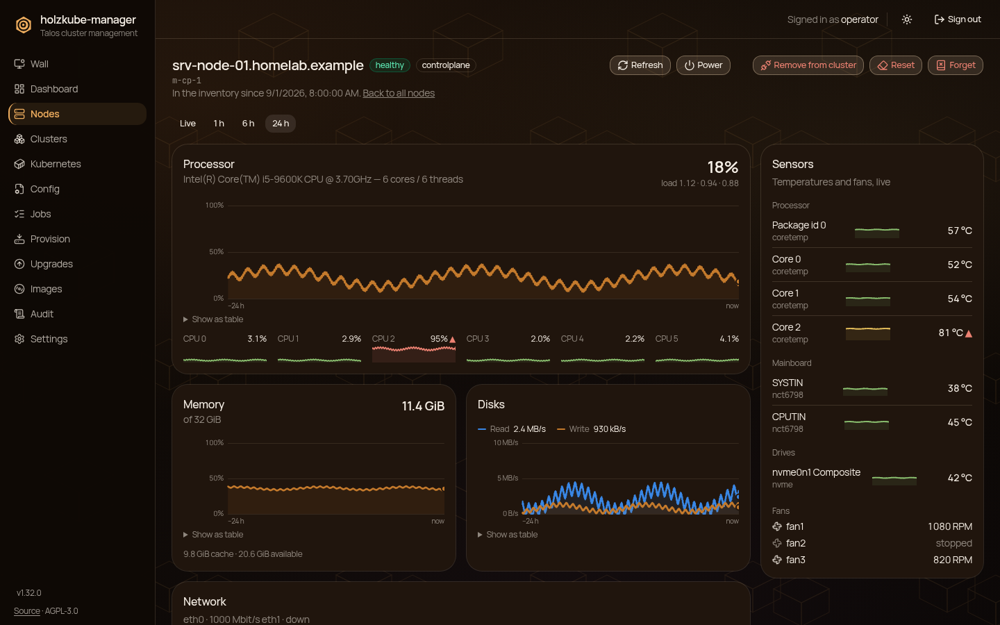
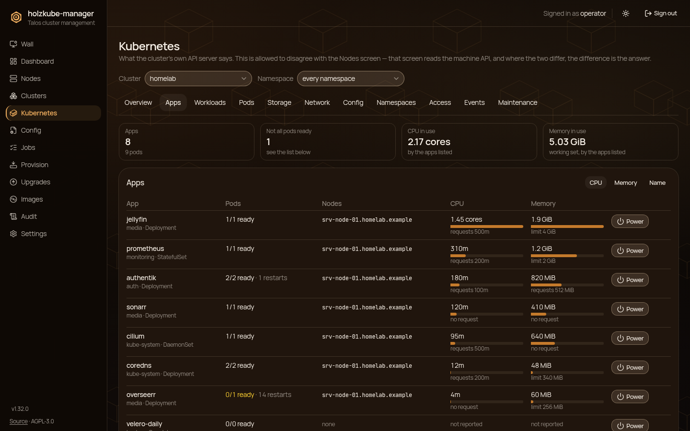
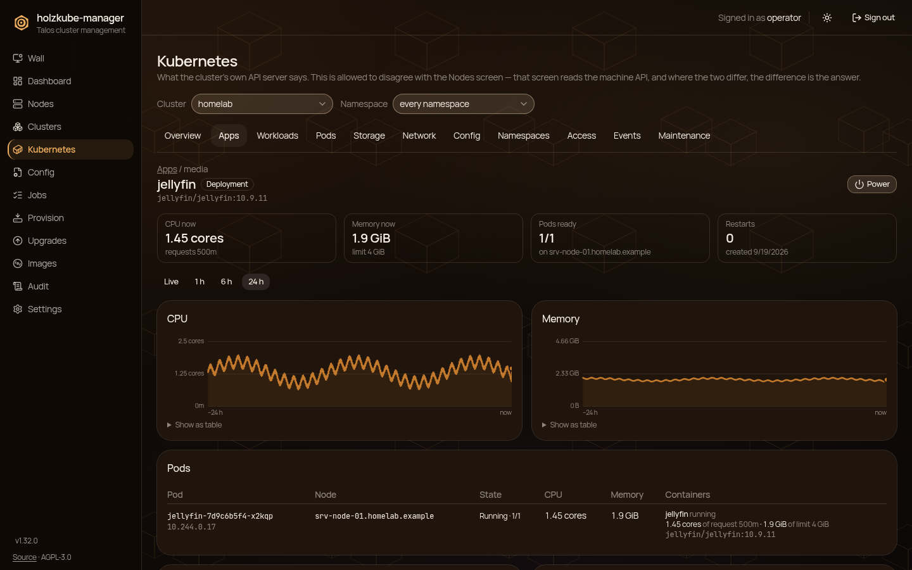
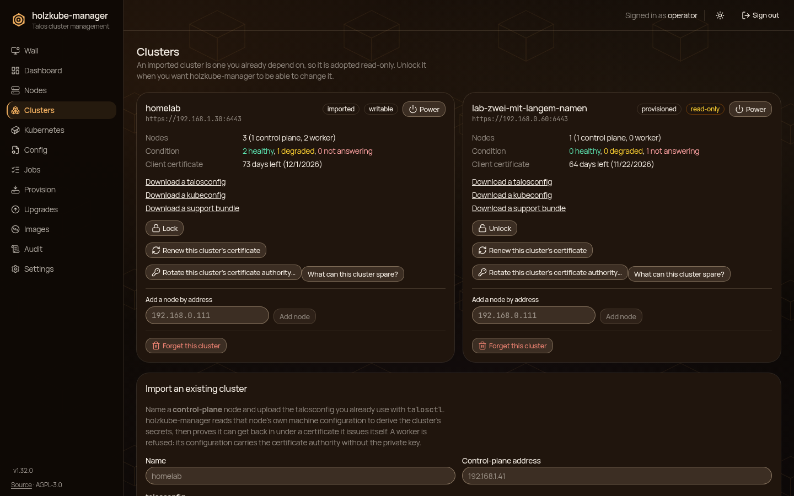
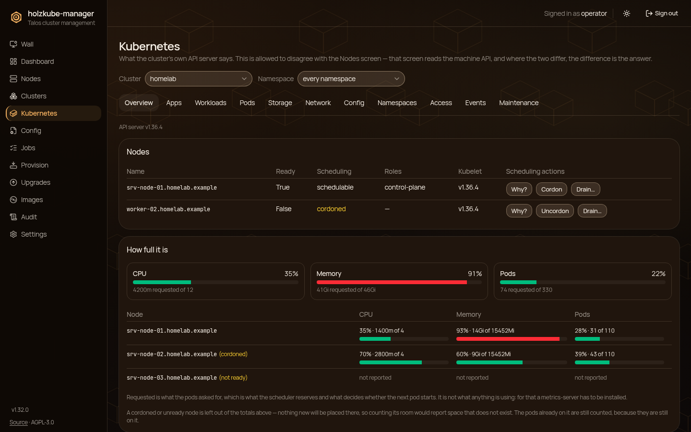
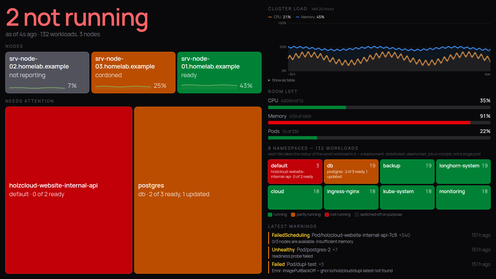
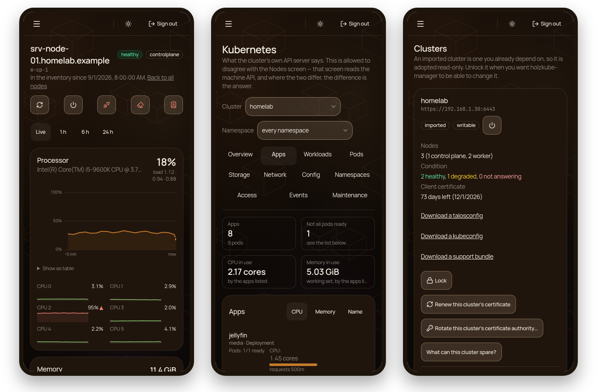

<p align="center">
  
</p>

<p align="center">
  <a href="https://github.com/holzcloud/holzkube-manager/releases/latest"></a>
  <a href="https://github.com/holzcloud/holzkube-manager/actions/workflows/ci.yml"></a>
  
  
  <a href="LICENSE"></a>
</p>

<p align="center">
  <b><a href="https://holzcloud.ch/holzkube-manager">Project page</a></b> ·
  <a href="docs/guide.md">Guide</a> ·
  <a href="https://github.com/holzcloud/holzkube-manager/releases">Releases</a>
</p>

**holzkube-manager** is a self-hosted web interface for clusters running
[Talos Linux](https://www.talos.dev) and the Kubernetes on top of them. It is
**one Go binary with the interface compiled in**, and it runs *beside* the
cluster rather than in it — a Raspberry Pi on the same network is enough. It
speaks the Talos machine API and the Kubernetes API directly and reads what it
shows live from the cluster, so a screen never says more than the cluster just
did.



## What it does

- **Clusters and nodes** — adopt an existing Talos cluster from its
  talosconfig or provision a new one; nodes that join or leave are followed
  from the cluster's own membership
- **Live hardware per node** — load per core, temperatures, fans, memory,
  disks and network, with the last 24 hours kept across restarts
- **Apps** — everything that runs, grouped by what was installed, with its CPU
  and memory now and over the day
- **Kubernetes** — workloads, pods and why one is broken, events, storage,
  networking, quotas, who may do what, cordon and drain, apply a manifest, run a
  command in a container
- **Power** — stop, start, restart or force it, for a whole cluster, one node or
  one app; Wake-on-LAN brings a node back
- **Lifecycle** — Talos upgrades built from Image Factory schematics,
  SecureBoot, disk encryption, etcd snapshots and restore, certificate renewal
- **A wall** — one page for a screen in the office that answers "is everything
  fine?" without anybody touching it
- **Safe by default** — a local account and single sign-on (OIDC), roles,
  re-authentication before anything destructive, a hash-chained audit log, and a
  `--dry-run` mode that refuses every change at the wire
- **Around it** — `holzkubectl` on the command line, Prometheus `/metrics`, a
  support bundle, and an interface that works on a phone

## A look around

**Apps.** What is installed on the cluster, heaviest first, and the detail of
one: its pods, where they run, and what it used over the day.





**Clusters.** Each cluster with its nodes, their condition and its
certificate, and everything you do to a cluster in one place.



**Kubernetes.** What the cluster's own API server says — which is allowed to
disagree with the machine API, and where the two differ, the difference is the
answer.



**The wall.** Every node and workload as a tile, how full the cluster is and
the latest warnings. It never scrolls, and it always says how old its answer is.



**On a phone.** Every screen, one-handed.



## Quick start

Download the archive for your machine from the
[latest release](https://github.com/holzcloud/holzkube-manager/releases/latest)
(`linux_arm64` for a Raspberry Pi, `linux_amd64` otherwise), then:

```sh
tar xzf holzkube-manager_*_linux_arm64.tar.gz
./holzkube-managerd
```

Open `https://<host>:8443` and create the first account in the browser. The
certificate is self-signed; compare the fingerprint your browser shows with the
`sha256_fingerprint` line in the log before accepting it.

Prefer a container? `docker compose up -d` with the
[`compose.yaml`](compose.yaml) in this repository. To build from source you
need Go 1.26 and Node:

```sh
task build    # web first, then Go: bin/holzkube-managerd and bin/holzkubectl
```

Configuration, single sign-on, backups, upgrades, the systemd unit and
everything else is in the **[guide](docs/guide.md)**.

## Documentation

- [Guide](docs/guide.md) — building, running, configuring and operating
- [API contract](docs/api-contract.md) — routes, errors, CSRF and the audit query
- [talossim](docs/talossim.md) — the in-process Talos node the tests run against
- [Contributing](CONTRIBUTING.md) and [security](SECURITY.md)

## Licence

holzkube-manager is free software under the
[GNU Affero General Public License v3](LICENSE). Running it on your own cluster
obliges you to nothing; if you offer a modified version to other people over a
network, they are entitled to your changes.
