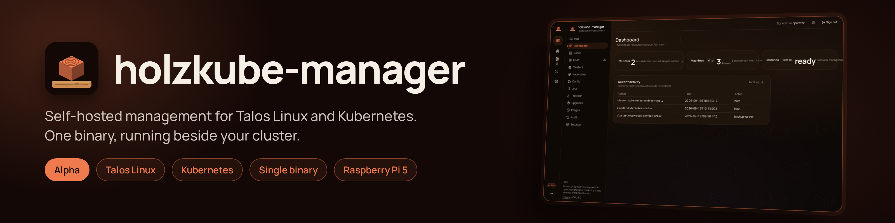
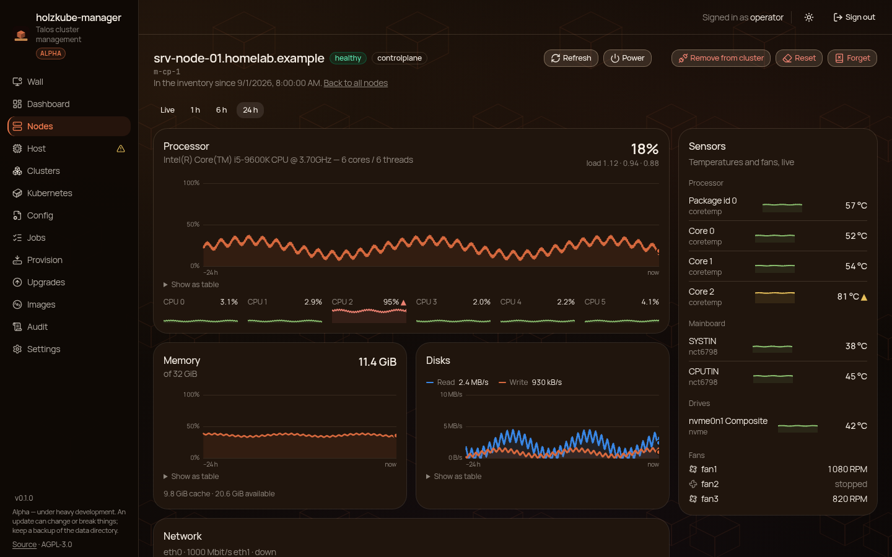
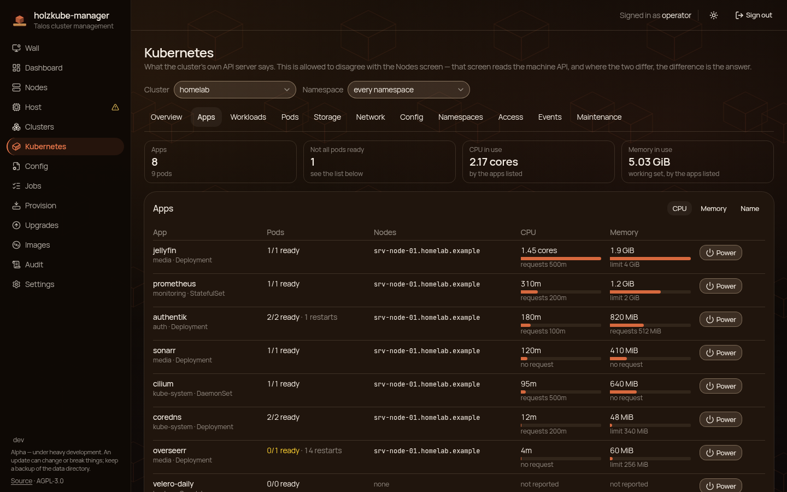
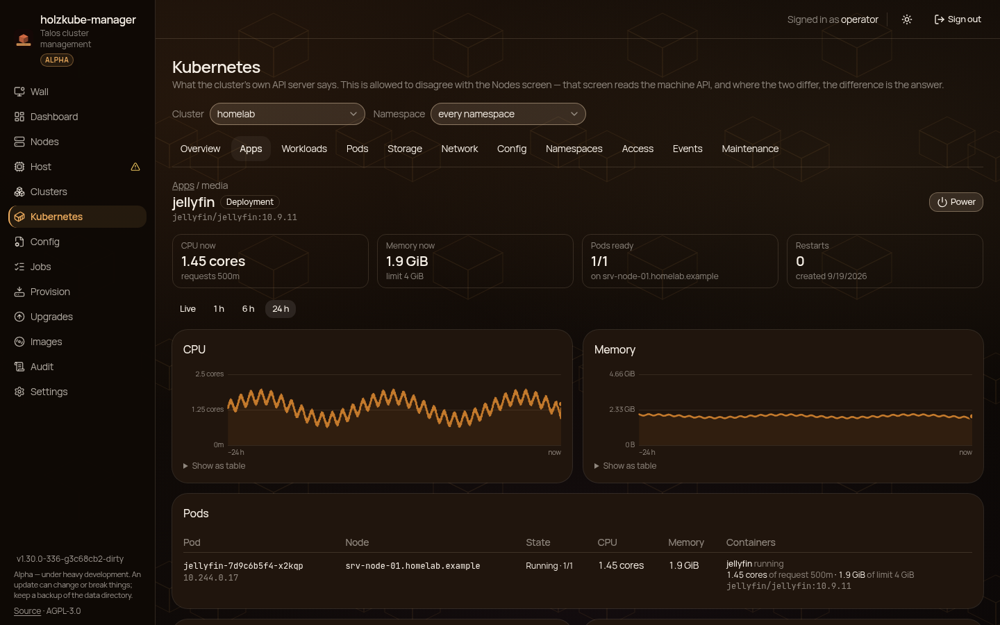
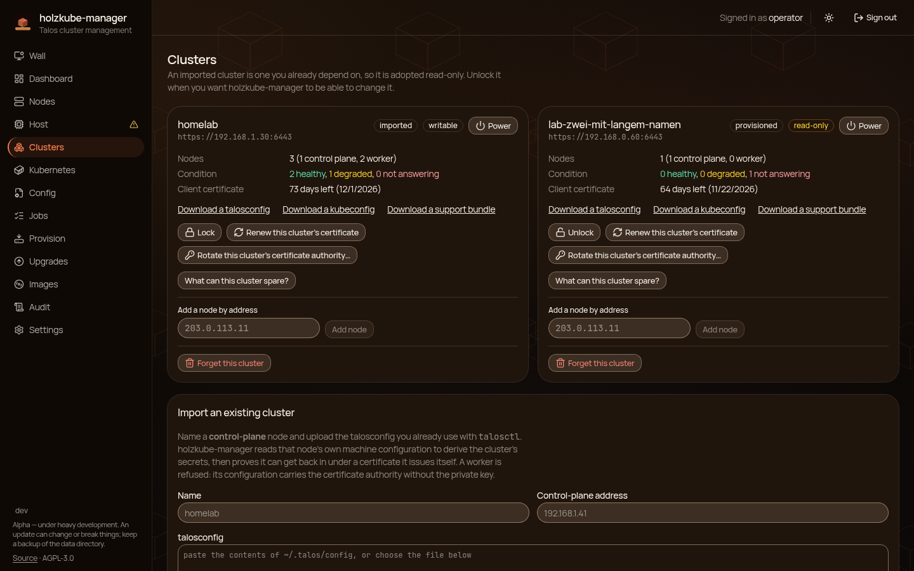
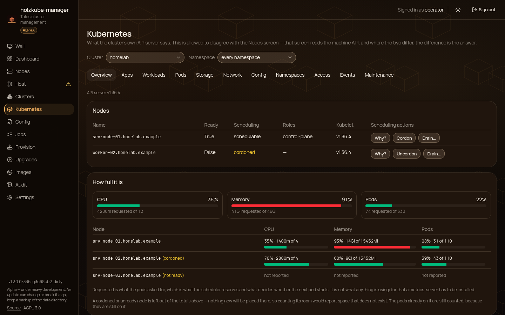
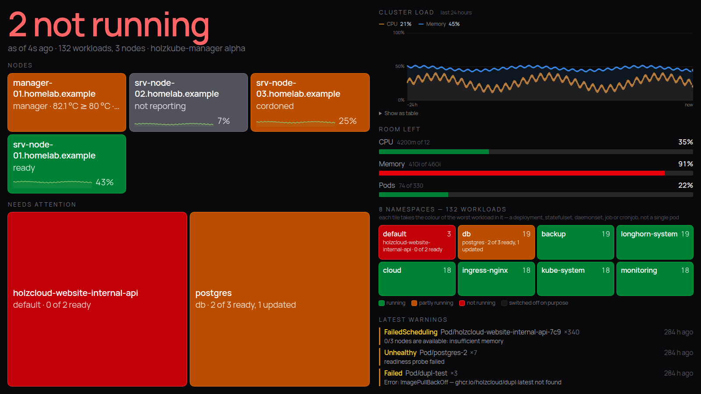
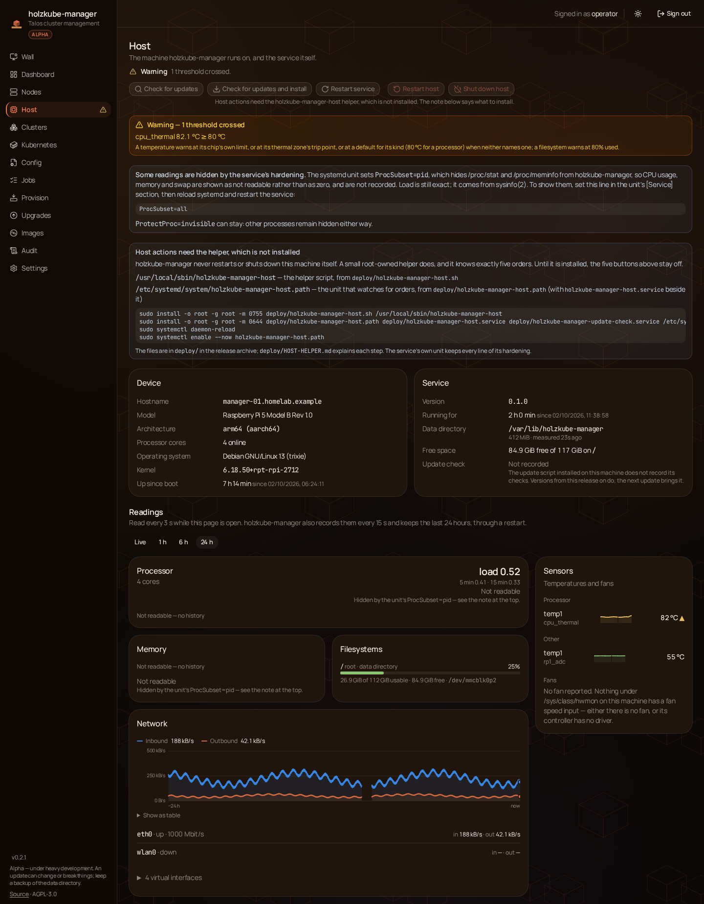
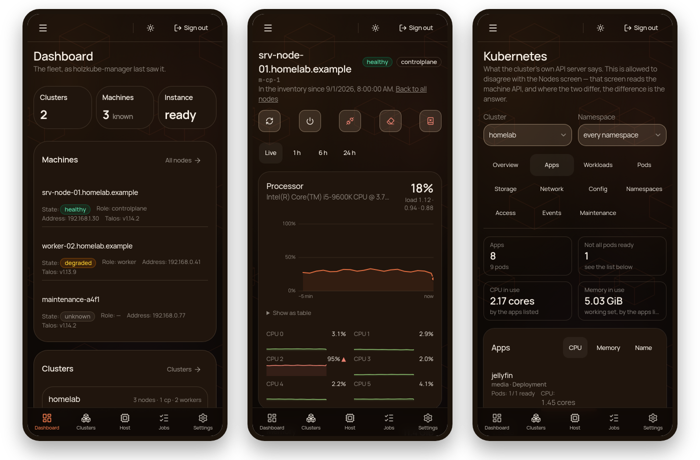

<p align="center">
  
</p>

<p align="center">
  
  <a href="https://github.com/holzcloud/holzkube-manager/releases"></a>
  <a href="https://github.com/holzcloud/holzkube-manager/actions/workflows/ci.yml"></a>
  
  
  <a href="LICENSE"></a>
</p>

<p align="center">
  <b><a href="https://holzcloud.ch/holzkube-manager">Project page</a></b> ·
  <a href="docs/guide.md">Guide</a> ·
  <a href="https://github.com/holzcloud/holzkube-manager/releases">Releases</a>
</p>

**holzkube-manager** is a self-hosted web interface for clusters running
[Talos Linux](https://www.talos.dev) and the Kubernetes on top of them. It is
**one Go binary with the interface compiled in**, and it runs *beside* the
cluster rather than in it — a Raspberry Pi on the same network is enough. It
speaks the Talos machine API and the Kubernetes API directly and reads what it
shows live from the cluster, so a screen never says more than the cluster just
did.

> [!WARNING]
> **holzkube-manager is alpha software under heavy development.** Any release
> can change or remove features, the API and the data directory's format, and
> an update can break things. Keep a backup of the data directory (see the
> [guide](docs/guide.md#backups)) and read the release notes before updating.



## What it does

- **Clusters and nodes** — adopt an existing Talos cluster from its
  talosconfig or provision a new one; nodes that join or leave are followed
  from the cluster's own membership
- **Live hardware per node** — load per core, temperatures, fans, memory,
  disks and network, with the last 24 hours kept across restarts
- **The machine it runs on** — the Host page: what the device is, which
  version runs and what the last update check found, and live CPU, memory,
  filesystems, temperatures and network throughput, with 24 hours of history
  kept across restarts and shown over 1 h, 6 h or 24 h like a node's; a warning
  when a temperature or a filesystem crosses its threshold, naming the value and
  the threshold; its state (healthy, warning, not readable) in the navigation
  and as a tile on the wall; a value the service's hardening hides says so
  instead of showing 0; and from the same page restart the service, restart or
  shut down the machine, or check for an update and install it — carried out by
  a small root-owned helper the operator installs from `deploy/`, while the
  service itself never gets root
- **Apps** — everything that runs, grouped by what was installed, with its CPU
  and memory now and over the day
- **Kubernetes** — workloads, pods and why one is broken, events, storage,
  networking, quotas, who may do what, cordon and drain, apply a manifest, run a
  command in a container
- **Power** — stop, start, restart or force it, for a whole cluster, one node or
  one app; Wake-on-LAN brings a node back
- **Lifecycle** — Talos upgrades built from Image Factory schematics,
  Kubernetes upgrades in `talosctl upgrade-k8s`'s order,
  SecureBoot, disk encryption, etcd snapshots and restore, certificate renewal
- **A wall** — one page for a screen in the office that answers "is everything
  fine?" without anybody touching it
- **Safe by default** — a local account and single sign-on (OIDC), roles,
  re-authentication before anything destructive, a hash-chained audit log, and a
  `--dry-run` mode that refuses every change at the wire
- **Around it** — `holzkubectl` on the command line, Prometheus `/metrics`, a
  support bundle, and an interface that works on a phone and sits on its home
  screen like an app

## A look around

**Apps.** What is installed on the cluster, heaviest first, and the detail of
one: its pods, where they run, and what it used over the day.





**Clusters.** Each cluster with its nodes, their condition and its
certificate, and everything you do to a cluster in one place.



**Kubernetes.** What the cluster's own API server says — which is allowed to
disagree with the machine API, and where the two differ, the difference is the
answer.



**The wall.** Every node and workload as a tile — the machine holzkube-manager
runs on first among them — how full the cluster is and the latest warnings. It never scrolls, and it always says how old its answer is.



**Host.** The machine holzkube-manager itself runs on: what it is, the service
and its last update check, and how it is doing right now. A value the service's
hardening hides says so, and says which line shows it, instead of reading 0.
Here the processor has run past its warning line: the notice says which value
crossed which threshold, and the day's curves show it climbing — with a gap
where the service was stopped, not a line drawn across it. The four host
actions sit in the header, switched off here: the helper that carries them out
is not installed yet, and the notice below the hardening note names what is
missing and the commands that install it.



**On a phone.** Every screen, one-handed.



## Quick start

Download the archive for your machine from the
[newest release](https://github.com/holzcloud/holzkube-manager/releases)
(`linux_arm64` for a Raspberry Pi, `linux_amd64` otherwise), then:

```sh
tar xzf holzkube-manager_*_linux_arm64.tar.gz
./holzkube-managerd
```

Open `https://<host>:8443` and create the first account in the browser. The
certificate is self-signed; compare the fingerprint your browser shows with the
`sha256_fingerprint` line in the log before accepting it.

Prefer a container? `docker compose up -d --build` in a checkout builds the
image from the [`compose.yaml`](compose.yaml) in this repository. To build from source you
need Go 1.26 and Node:

```sh
task build    # web first, then Go: bin/holzkube-managerd and bin/holzkubectl
```

Configuration, single sign-on, backups, upgrades, the systemd unit and
everything else is in the **[guide](docs/guide.md)**.

## Documentation

- [Guide](docs/guide.md) — building, running, configuring and operating
- [API contract](docs/api-contract.md) — routes, errors, CSRF and the audit query
- [talossim](docs/talossim.md) — the in-process Talos node the tests run against
- [Contributing](CONTRIBUTING.md) and [security](SECURITY.md)

## Licence

holzkube-manager is free software under the
[GNU Affero General Public License v3](LICENSE). Running it on your own cluster
obliges you to nothing; if you offer a modified version to other people over a
network, they are entitled to your changes.
